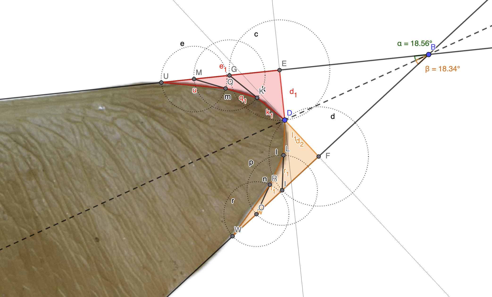
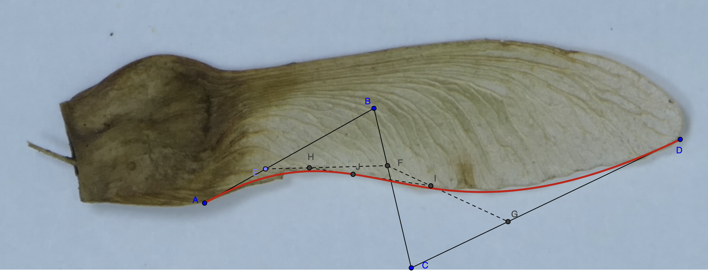
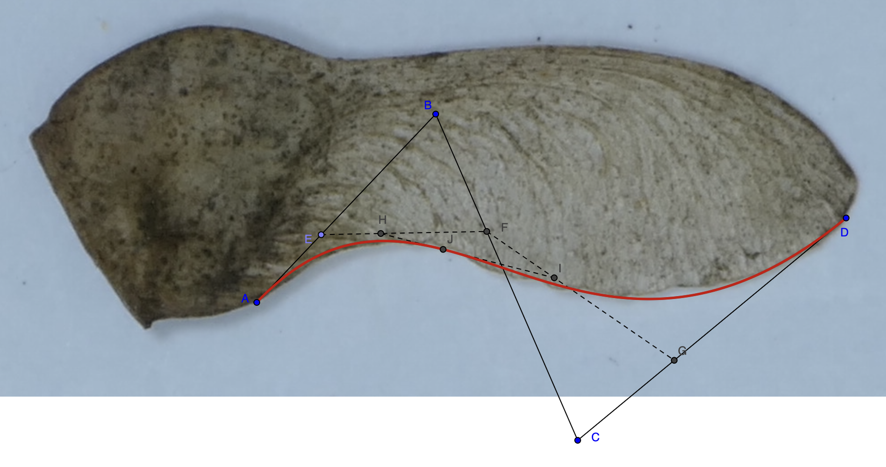
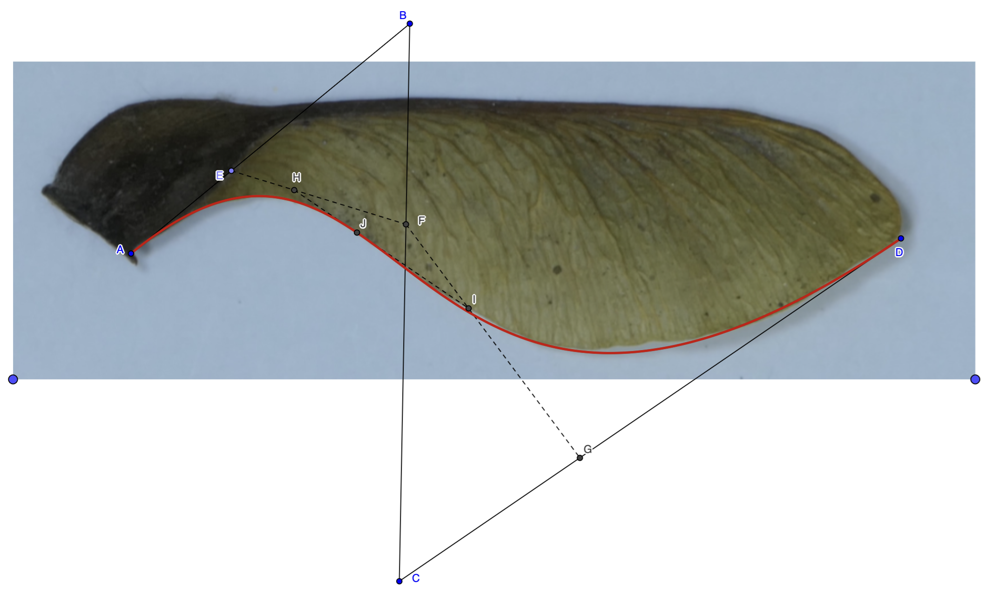

```{r setup, include=FALSE}
knitr::opts_chunk$set(echo = FALSE, fig.pos = "H", out.extra = "")
options(knitr.table.format = function() {
  if (knitr::is_latex_output())
    "latex" else "html"
})
```

```{r, include=FALSE}
library(tidyverse)
library(kableExtra)
```

```{r echo=FALSE}
source("inc/functions.R")
```
\renewcommand{\listfigurename}{}
\renewcommand{\listtablename}{}

\pagenumbering{gobble}

\begin{center}
\vspace*{4\baselineskip}
{\Huge Topology optimisation in samaras:\\ using maple species as an example} \\
\vspace*{1\baselineskip}
{\large Topologieoptimierung von Samaras (Flügelnussfrüchten) am Beispiel von Ahornarten} \\
\vspace*{2\baselineskip}
von \\
\vspace*{1\baselineskip}
{\huge Florian Mischke} \\
\vspace*{2\baselineskip}
geboren am \\
\vspace*{1\baselineskip}
{\large 11.01.1990} \\
\vspace*{2\baselineskip}
{\Large Bachelorarbeit im Studiengang Bachelor of Science Biologie\\der Universität Hamburg} \\
\vspace*{2\baselineskip}
2026
\vspace*{2\baselineskip}


{\large Gutachterin: Prof. Dr. Linnea Hesse} \\
{\large Gutachter: Prof. Dr. Dominik Begerow}
\end{center}


\newpage

\hypersetup{linkcolor = black}

\pagenumbering{roman}
\renewcommand*\contentsname{Table of Contents}
\tableofcontents

\newpage

\hypersetup{linkcolor = blue}

\pagenumbering{arabic}

# Statutory declaration {-}
```{r}
# Source - https://stackoverflow.com/a/52687040
# Posted by Rob Smith, modified by community. See post 'Timeline' for change history
# Retrieved 2026-07-15, License - CC BY-SA 4.0
```
{width=100%}
\newpage

```{r}
# \section{List of acronyms}
```
# List of acronyms {-}
\begin{acronym}
    \acro{l}[L.]{Carl Linnaeus, also known as Carl von Linné}
    \acro{A}[A.]{Acer, scientific name of Maple}
\end{acronym}

# Abstract
Something, something, something, Samaras.

# Introduction

Test [@lentink_leading-edge_2009].

# Methods and materials

## Samples

More than 150 (more or less) intact samaras were gathered (>50 per species).

1. _Acer campestre_ \acs{l}- Loki Schmidt Garten, Hamburg - what3words:  [///kennels.slippery.hears](https://w3w.co/kennels.slippery.hears)
2. _Acer pseudoplatanus_ \acs{l}- Stadtpark, Hamburg - what3words:  [///engaging.survey.spout](https://w3w.co/engaging.survey.spout)
3. _Acer platanoides_ \acs{l}- Spannskamp, Hamburg - what3words:  [///bristle.ruins.curated](https://w3w.co/bristle.ruins.curated)
4. _Acer platanoides_ \acs{l}- IPM, Hamburg - what3words:
[///gardens.rattled.yappy](https://w3w.co/gardens.rattled.yappy)

## Photos for measuring and geometry experiments

An A3 sheet of millimeter paper was placed on the ground and secured with transparent sticky tape. A 10x4 cm cutout of white printer paper was taped on it. One samara at a time was placed on that paper and a sticky note with date/time and species name was placed below.  
A digital camera (Panasonic Lumix G, Model No. DC-FZ100002) was secured on a tripod stand at maximum height, pointed down and leveled via spirit level. Distance from ground to camera lens was measured 134cm. The following settings were chosen to take photos: Focal length 400, S 4, F 11, ISO 125; manual mode. Photos of the setup were taken, see figure \ref{fig:camera_setup}.

50 photos for _Acer pseudoplatanus_ and _\acs{A} campestre_ and 100 photos for _A. platanoides_, 50 for each of the two samples were taken by remote control with the Panasonic Image App. The photos were copied to a Laptop and backed up to cloud storage and an external SSD.

```{r, echo=FALSE, out.width="45%", fig.align = "center", fig.show='hold', fig.cap="\\label{fig:camera_setup}Camera on tripod pointed down on millimeter sheet of paper. Samara is positioned on the white paper strip (left). View of the camera display (right). Source: own work"}
# Source - https://stackoverflow.com/a/63866499
# Posted by Werner Hertzog, modified by community. See post 'Timeline' for change history
# Retrieved 2026-08-03, License - CC BY-SA 4.0
knitr::include_graphics(
  c("img/setup/IMG_4753.jpeg",
    "img/setup/IMG_4754.jpeg")
)
```


## Stained sections

Two fresh samaras each of _Acer campestre_ and _A. pseudoplatanus_ were conserved in 60% Ethanol.

# Results

```{r echo=FALSE}
results <- read.csv("data/2026-07-14--09-56--Results.csv")

results <- results |> mutate(
  FeretLength_mm = Feret*10,
  maxWidth_mm = maxWidth*10,
  ratio = FeretLength_mm / maxWidth_mm)

#str(results)
#summary(results)

results |> summarise(
  'var_feret_mm' = var(FeretLength_mm), # variance
  'sd_feret_mm' = sd(FeretLength_mm), # standard deviation
  'se_feret_mm' = fm_se(FeretLength_mm), # standard error
  'var_width_mm' = var(maxWidth_mm), # variance
  'sd_width_mm' = sd(maxWidth_mm), # standard deviation
  'se_width_mm' = fm_se(maxWidth_mm) # standard error
)
```

```{r echo=FALSE}
samples_images <- readxl::read_excel("data/samples_images.xlsx") 
```

```{r echo=FALSE}
my_data <- merge(x = results, y = samples_images, by = "FileName", all = TRUE)
my_data <- my_data |> mutate(
  sample = paste(Species, Location, sep = "\n")
) |> group_by(sample) |> mutate(
  n = n(),
  label = paste0(sample,'\nn = ',n)
)
my_data_longer <- my_data |> pivot_longer(cols = c(FeretLength_mm,maxWidth_mm), names_to = "unit_mm", values_to = "value")
```

```{r echo=FALSE, include=FALSE}
my_data |> group_by(Species, Location) |> summarize(
  n = n()
)
```


```{r feret_width_three_acer_species, fig.cap="\\label{fig:feret_width_three_acer_species_label}Feret lengths and maximum widths of three Acer species."}
my_data_longer |> ggplot(
  mapping = aes(
    x = label,
    y = value,
    color = factor(unit_mm, labels = c("Feret length", "maximum width"))
  )
) + geom_boxplot() +
  #ggtitle("Feret lengths and maximum widths of three Acer species.") +
  labs(x = "Species", y = "[mm]", color = "") +
  theme(axis.text.x = element_text(angle = 45, vjust = 1, hjust=1))
```

```{r feret_width_two_platanoides_samples, fig.cap="\\label{fig:feret_width_two_platanoides_samples_label}Feret lengths and maximum widths of two samples of Acer platanoides."}
my_data_longer |> filter(Species == "Acer platanoides") |> ggplot(
  mapping = aes(
    x = label,
    y = value,
    color = factor(unit_mm, labels = c("Feret length", "maximum width"))
  )
) + geom_boxplot() +
  #ggtitle("Feret lengths and maximum widths of two samples of Acer platanoides.") +
  labs(x = "Location", y = "[mm]", color = "")
```

```{r feret_width_four_acer_samples, fig.cap="\\label{fig:feret_width_four_acer_samples_label}Feret lengths and maximum widths of four samples of Acer species."}
my_data_longer |> ggplot(
  mapping = aes(
    x = label,
    y = value,
    color = factor(unit_mm, labels = c("Feret length", "maximum width"))
  )
) + geom_boxplot() +
  #ggtitle("Feret lengths and maximum widths of four samples of Acer species.") +
  labs(x = "Species and Location", y = "[mm]", color = "") +
  theme(axis.text.x = element_text(angle = 45, vjust = 1, hjust=1))
```

## Length/width ratios

```{r ratios_boxplot, fig.cap="\\label{fig:ratios_boxplot_label}Length/width ratios of four samples of Acer species"}
my_data |> ggplot(
  mapping = aes(
    x = label,
    y = ratio,
  )
) + geom_boxplot() +
  #ggtitle("Length/width ratios of four samples of Acer species") +
  labs(x = "Species and Location", y = "Ratio", color = "") +
  theme(axis.text.x = element_text(angle = 45, vjust = 1, hjust=1))
```

```{r ratios_hist, fig.cap="\\label{fig:ratios_hist_label}Length/width ratios of four samples of Acer species"}
my_data |> ggplot(
  mapping = aes(
    x = ratio
  )
) + geom_histogram(bins=50) +
  facet_wrap(~label)
```


### Kolmogorov–Smirnov test
(also K–S test or KS test) 
nonparametric test of the equality of continuous (or discontinuous) one-dimensional probability distributions.
```{r}
sample1 <- my_data |> filter(Species == "Acer campestre")
sample2 <- my_data |> filter(Species == "Acer platanoides", Location == "IPM")
sample3 <- my_data |> filter(Species == "Acer platanoides", Location == "Spannskamp")
sample4 <- my_data |> filter(Species == "Acer pseudoplatanus")

ks.test(sample1$ratio, "pnorm", mean = mean(sample1$ratio), sd = sd(sample1$ratio))
ks.test(sample2$ratio, "pnorm", mean = mean(sample2$ratio), sd = sd(sample2$ratio))
ks.test(sample3$ratio, "pnorm", mean = mean(sample3$ratio), sd = sd(sample3$ratio))
ks.test(sample4$ratio, "pnorm", mean = mean(sample4$ratio), sd = sd(sample4$ratio))
```

### Shapiro-Wilk test
```{r}
shapiro.test(my_data$ratio[my_data$Species == "Acer campestre"])
shapiro.test(my_data$ratio[my_data$Species == "Acer platanoides" & my_data$Location == "IPM"])
shapiro.test(my_data$ratio[my_data$Species == "Acer platanoides" & my_data$Location == "Spannskamp"])
shapiro.test(my_data$ratio[my_data$Species == "Acer pseudoplatanus"])
```

### Levene test
```{r}
car::leveneTest(ratio ~ sample, my_data)
```

### ANOVA
Ratio ~ sample
```{r}
mod <- aov(formula = my_data$ratio ~ my_data$sample, data = my_data)

summary(mod)
```

## Topology Optimization after Mattheck

Triangle-of-forces method

```{r mattheck1, echo=FALSE, out.width="100%", fig.align = "center", fig.show='hold', fig.cap="Mattheck method applied to wing tip of a sample of A. platanoides. Source: own work"}

```

## Bézier curves

Figure \ref{fig:P1116641_bezier} shows that the shape of a sample of _Acer platanoides_ can be described by a Bézier curve.
Figures \ref{fig:P1116588_bezier} and \ref{fig:P1116384_bezier} show the same for _Acer campestre_ and _Acer pseudoplatanus_.

```{r P1116641_bezier, echo=FALSE, out.width="100%", fig.align = "center", fig.show='hold', fig.cap="Bézier curve on a sample of Acer platanoides Source: own work"}

```

```{r P1116588_bezier, echo=FALSE, out.width="100%", fig.align = "center", fig.show='hold', fig.cap="Bézier curve on a sample of Acer campestre Source: own work"}

```

```{r P1116384_bezier, echo=FALSE, out.width="100%", fig.align = "center", fig.show='hold', fig.cap="Bézier curve on a sample of Acer pseudoplatanus. Source: own work"}

```
### Bezier curve simulation

```{r}
library(bezier)
t <- seq(0, 1, length=100)
p <- matrix(c(0.48,6.04, 9.56,13.54, 9.22,-4.65, 25.58,6.54), nrow=4, ncol=2, byrow=TRUE)
bezier_points <- bezier(t=t, p=p)

df_bezier_points <- data.frame(bezier_points)
colnames(df_bezier_points) <- c("X","Y")

print(p)
```

Figure \ref{fig:bezier_curve_simulation}

```{r bezier_curve_simulation, echo=FALSE, out.width="100%", fig.align = "center", fig.show='hold', fig.cap="Bézier curve simulation. Source: own work"}

df_bezier_points |> ggplot(
  mapping = aes(
    x = X,
    y = Y
  )
) + 
  geom_line(color = "red") + 
  coord_fixed(ratio = 1) + 
  theme_minimal()
```

```{r}
#data_curve_points <- readxl::read_excel("data/bezier_points.xlsx")
data_curve_points <- read.csv("svg/svg_points.csv")
data_curve_points_merged <- data_curve_points |> mutate(
  key = str_remove(FileName, "\\.[^.]+$")
) |> left_join(
  samples_images |> mutate(
    key = str_remove(FileName, "\\.[^.]+$")
), by = "key"
)
#data_curve_points_wider <- data_curve_points |> pivot_wider(names_from = Point, values_from = c(X,Y))

data_curve_points_adjusted <- data_curve_points_merged |> 
  group_by(FileName.x) |> 
  mutate(
    X_A = X[Point == "A"],
    Y_A = Y[Point == "A"],
    X = X - X_A,
    Y = Y - Y_A
  ) |> 
  ungroup() |> 
  select(-X_A, -Y_A)

bezier_df <- data_curve_points_adjusted |> 
  group_by(FileName.x, Species) |> 
  group_modify(~ {

    # Kontrollpunkte A, B, C, D
    # Jede Zeile = ein Kontrollpunkt
    control_points <- as.matrix(.x[, c("X", "Y")])

    # Parameter t
    t <- seq(0, 1, length.out = 100)

    # Kubische Bézier-Kurve aus 4 Kontrollpunkten
    curve <- bezier(
      t = t,
      p = control_points
    )

    # Als Dataframe zurückgeben
    data.frame(
      t = t,
      X = curve[, 1],
      Y = curve[, 2]
    )
  }) |> 
  ungroup()

bezier_df <- bezier_df %>%
  group_by(Species) %>%
  mutate(
    Sample = dense_rank(FileName.x)
  ) %>%
  ungroup()

# Kurven plotten
bezier_df |> group_by(Species) |> mutate(
  n = n_distinct(FileName.x),
  label = paste0(Species,'\nn = ',n)
) |> ggplot(aes(x = X, y = Y, group = FileName.x, color = label, linetype = factor(Sample))) +
  geom_path(linewidth = 0.5, alpha = 0.5) +
  coord_equal() +
  theme_minimal() +
  theme(legend.position = 'bottom') +
  guides(linetype = "none") +
  scale_linetype_manual(
    values = c(
      "1" = "solid",
      "2" = "dashed",
      "3" = "dotted",
      "4" = "dotdash",
      "5" = "longdash"
    )
  )
```


# Discussion

Probleme: 

- beim Messen: Übergang zwischen Same und Flügel nicht immer gleich. Mal klar abgegrenzt, mal mit fließendem Übergang; Lösung: ganze Frucht ausmessen
- Auslösen an der Kamera führt zu verwackeltem Bild, Remote Control App löst das Problem. (Verzögerung auch Option, aber Zeitverlust.)
- Stichprobe mit 50 Früchten pro Spezies groß genug, besser wären unabhängiere Daten. Z.B. 5 Bäume pro Spezies, jeweils 10 Früchte aus verschiedenen Blütenständen. 

# Conclusion

# Acknowledgements {-}

# Bibliography {-}
\bibliographystyle{alpha}
::: {#refs}
:::

## Use of AI/GenAI (generative Artificial Intelligence)
- ChatGPT for help at coding a FIJI macro
- DeepL for translating German to English

# List of Figures {-}
\bgroup
\hypersetup{linkcolor = Cerulean}
\listoffigures
\egroup

# List of Tables {-}
\listoftables